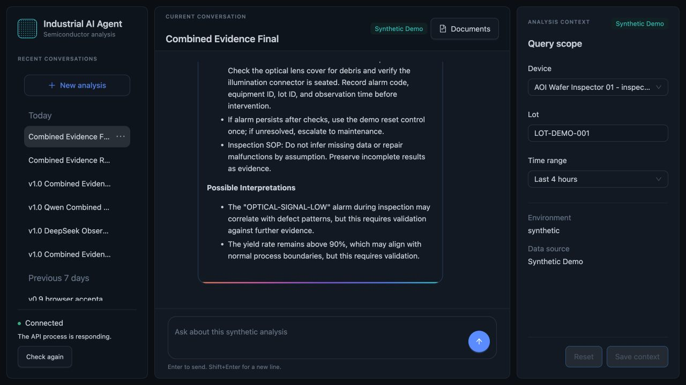
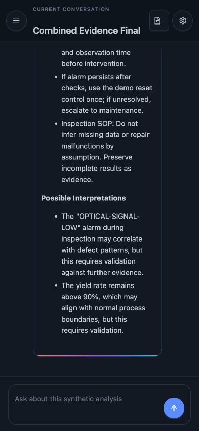

# Industrial AI Agent for Semiconductor Manufacturing

Industrial AI Agent is an independently developed, locally reproducible
full-stack project for examining traceable AI-assisted manufacturing
workflows. It uses fictional equipment, synthetic production records, and
independently written documents. It does not contain production data,
proprietary system material, or a connection to live equipment.

The primary workflow combines one deterministic manufacturing evidence path
with Document Search in the same exchange. Manufacturing evidence runs first;
only allowlisted recorded fields may enrich retrieval. The interface keeps
calculated values, retrieved sources, model interpretation, and missing
evidence visibly separate. Co-occurrence is never presented as proof of cause.

> **v1.0 status: Implemented.** The release boundary passed local deterministic
> verification, browser and screenshot review, public-copy and publication
> review, two-axis code review, and GitHub Actions on 2026-08-15.

## What the repository demonstrates

- FastAPI and SQLite conversation persistence with explicit Alembic migrations;
- synchronous and SSE assistant exchanges with completed-response persistence
  and canonical Evidence Snapshots attached to assistant messages;
- deterministic production summary, recorded equipment status, and defect
  distribution tools over one fictional AOI dataset;
- structured English and Traditional Chinese routing with bounded retry,
  clarification, and fallback behavior;
- local Markdown retrieval with stable citations, deterministic feature-hashing
  embeddings, and no external vector database;
- one bounded manufacturing-then-document Combined Evidence workflow;
- a responsive React, Ant Design 6, and Ant Design X workbench;
- an independent local stdio MCP server for three deterministic manufacturing
  tools; and
- a 45-scenario deterministic offline evaluation suite.

## Combined Evidence

The desktop and 390 px screenshots below show the same accepted local
happy-path observation with `qwen3:14b`. Model wording is not a reproducibility
target; the route, typed evidence, citations, provenance, and grounding rules
are. See the [demo contract](docs/demo.md) for the exact prompt and acceptance
invariants.





## Architecture

The browser sends message requests through the FastAPI SSE boundary. The
application owns routing and calls deterministic domain tools before asking an
optional OpenAI-compatible model to synthesize an answer. SQLite stores
conversations, messages, workspace context, and canonical completed Evidence
Snapshots on assistant messages. Current Evidence remains scoped to the active
request; reloading history returns each completed snapshot with the assistant
message that produced it.

See [Architecture](docs/architecture.md) for the system boundary and Combined
Evidence sequence.

## Run locally

Prerequisites are Python 3.12, [uv](https://docs.astral.sh/uv/), Node.js 24,
and npm. The API can start without a model, but assistant requests require an
OpenAI-compatible service and `LLM_MODEL`.

```bash
cd apps/api
uv sync --locked
uv run alembic upgrade head
uv run uvicorn industrial_agent.main:app --host 127.0.0.1 --port 8000
```

In another terminal:

```bash
cd apps/web
npm ci
npm run dev
```

Vite proxies `/api` to `http://127.0.0.1:8000`. Configuration and endpoint
details are in the [API guide](apps/api/README.md) and
[Web guide](apps/web/README.md).

## Deterministic verification

```bash
cd apps/api
uv sync --locked
uv run alembic upgrade head
uv run pytest -q
uv run ruff check .
uv build
uv run industrial-agent-eval

cd ../web
npm ci
npm test -- --run
npm run typecheck
npm run lint
npm run build
```

The latest recorded results and release evidence are listed in
[Implementation Status](docs/implementation-status.md). GitHub Actions runs the
same deterministic boundary on Ubuntu. Model calls and secrets are excluded
from CI.

## Evidence boundaries

- Numeric manufacturing results come from deterministic Python code.
- Equipment status comes from explicit synthetic intervals, not inference.
- Document citations refer only to repository-owned fictional Markdown or a
  user's local upload.
- Model text is interpretation. It is not an equipment command, verified root
  cause, or production decision.
- A failed assistant request keeps the user message. A real-socket integration
  test verifies that disconnecting before completion does not persist a
  partial assistant message; upstream provider cancellation is not guaranteed.

## Known limitations

This is a local, single-user application. It has no authentication,
multi-tenant isolation, public deployment stack, live equipment integration,
persistent vector store, PDF/OCR ingestion, an evidence browser or complete
evidence timeline, pagination, Model Working Notes, or arbitrary
planner-driven multi-tool execution. Local Markdown uploads may be sent to the
configured model service when retrieved.

Dependency findings and their current exposure are recorded in the
[Security Review](docs/security-review.md). Evaluation scope and raw-artifact
handling are documented in [Evaluation](docs/evaluation.md).

## Documentation

- [Documentation index](docs/README.md)
- [Project scope](docs/project-scope.md)
- [Architecture](docs/architecture.md)
- [Demo](docs/demo.md)
- [Evaluation](docs/evaluation.md)
- [Security review](docs/security-review.md)
- [Implementation status](docs/implementation-status.md)
- [Roadmap](docs/roadmap.md)

## License

This project is available under the [MIT License](LICENSE).
