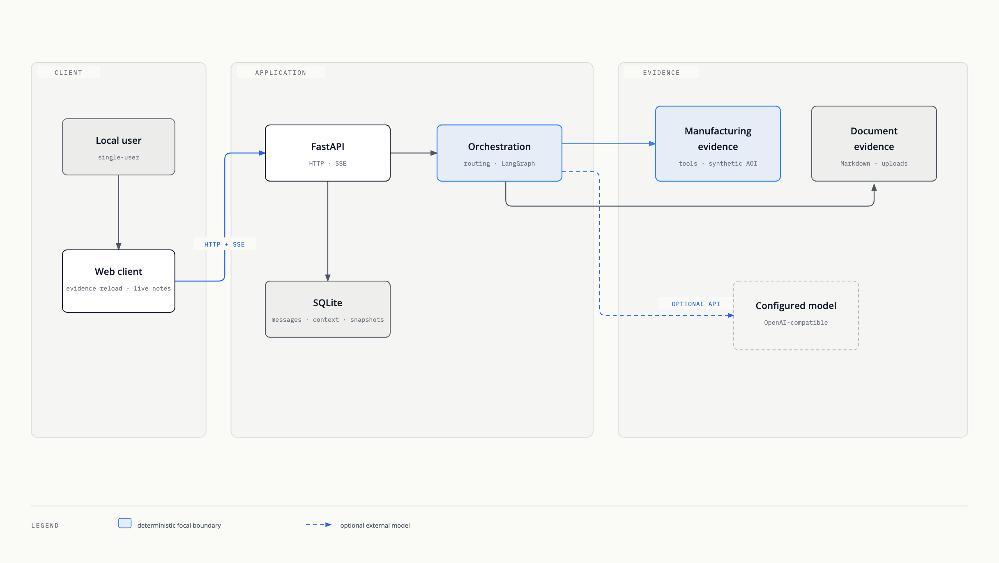
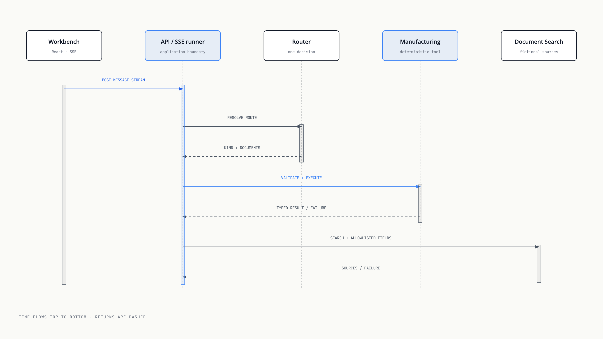
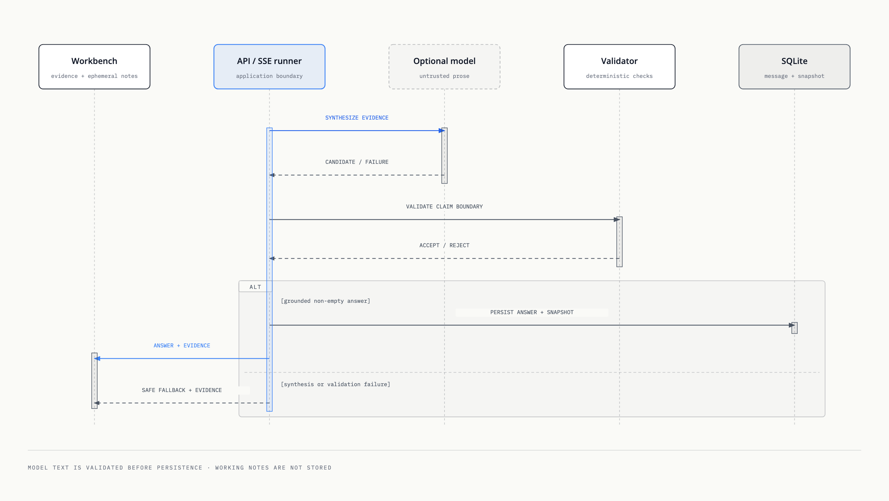

# Architecture

This guide describes the current local runtime. It does not propose production
infrastructure or treat planned behavior as implemented.

## System boundary

[Open the self-contained system boundary diagram](assets/system-boundary.html).

The solid edges are application-owned local boundaries. The model edge is
optional and may point to a local or external OpenAI-compatible service. If an
external service is configured, prompts and retrieved local document excerpts
leave the application boundary.

## Runtime responsibilities

| Boundary | Responsibility | Deliberate limit |
| --- | --- | --- |
| Web client | Conversation navigation, SSE consumption, workspace context, historical snapshot rendering, and temporary Model Working Notes. | Does not calculate manufacturing values or persist working notes. |
| FastAPI | HTTP contracts, validation, persistence coordination, and safe error responses. | No authentication, tenancy, or public-service hardening. |
| SQLite and Alembic | Conversations, messages, workspace context, and version-1 Evidence Snapshots with explicit schema migrations. | No shared or highly available database. |
| Routing and graph | One authoritative route, clarification, fallback, single-tool execution, and one bounded combined path. | No open-ended planner, checkpoint resume, or evidence-tool retry. |
| Manufacturing domain | Time-range validation, yield, defects, alarms, and recorded status over synthetic data. | No live state, throughput contract, or causal inference. |
| Document retrieval | Section-aware chunks, lexical eligibility, deterministic feature hashing, cosine ranking, and stable citations. | No semantic embedding service, reranker, PDF/OCR, or persistent vector store. |
| Model adapter | Optional answer and typed classification calls through an OpenAI-compatible API, with bounded final-answer reasoning separation. | Model wording and working notes are not deterministic evidence. |
| MCP | Three native deterministic tools over local stdio. | Independent from FastAPI, the web client, retrieval, and conversation context. |
| Evaluator | Fixed routing, evidence, retrieval, citation, and safe-failure assertions. | No LLM judge, live provider call, or performance benchmark. |

## Combined Evidence sequence

[Open the self-contained execution diagram](assets/combined-evidence-execution.html).

[Open the self-contained synthesis diagram](assets/combined-evidence-synthesis.html).

Manufacturing runs before retrieval. Only recorded alarm codes, status and
reason codes, or defect categories may enrich the document query. Each path
keeps its own loading, empty, failed, and succeeded state. A valid result from
one path remains visible when the other path fails, but the exchange is then a
partial failure rather than a complete success.

## Persistence and trust

The database stores the user message before model work begins. It stores an
assistant message only after a complete, non-empty response passes the current
workflow boundary. A real-socket test covers client disconnection before
completion; the user message remains, while partial assistant content is not
persisted. The application cannot guarantee that an upstream model provider
has stopped generating after the disconnect.

Each completed evidence-backed assistant message stores one canonical,
versioned Evidence Snapshot in the same persistence path as the Final Answer.
History reload reads that copy instead of rerunning tools or reconstructing
current data. Deleted uploads therefore do not remove excerpts already captured
in a snapshot. Missing snapshots remain absent; unreadable stored snapshots keep
the message visible and return an explicit Unavailable Evidence state.

Model text is untrusted interpretation. Supported final-answer reasoning may be
shown temporarily as Model Working Notes, but it is not stored in messages,
snapshots, or logs. It cannot change synthetic records, invoke equipment, or
turn an unsupported causal statement into deterministic evidence.
